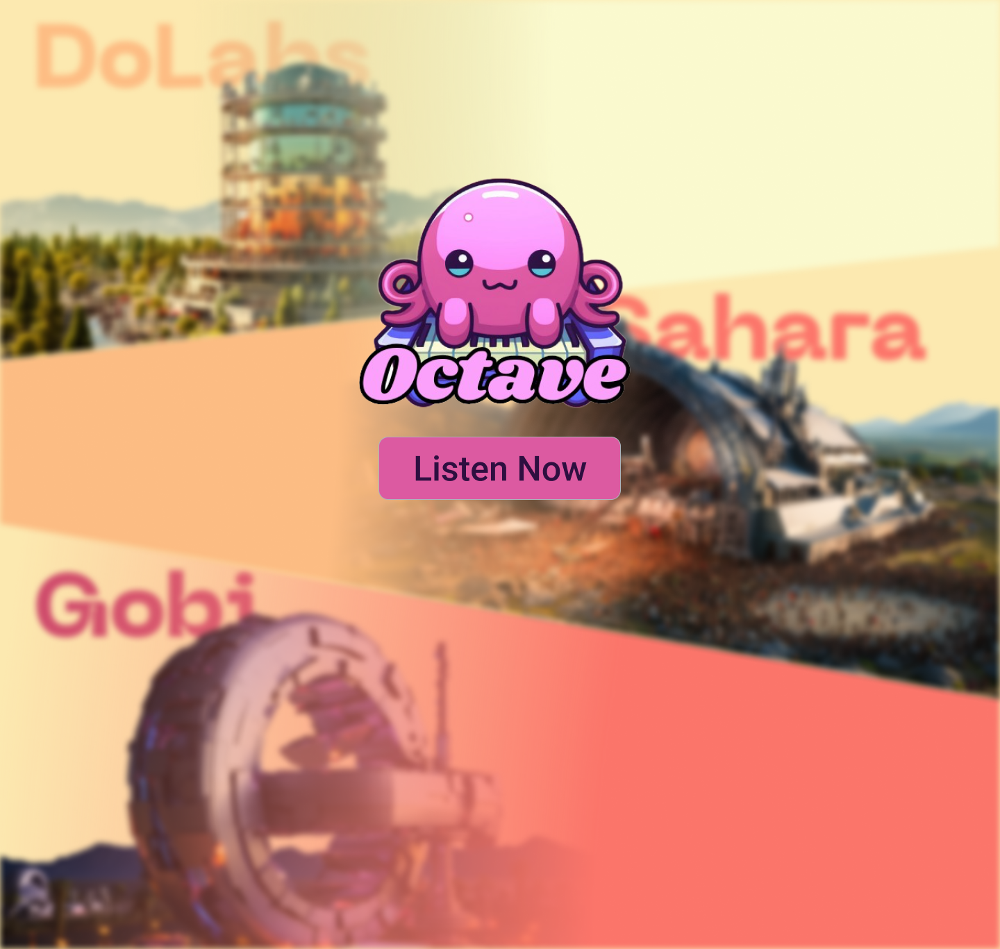
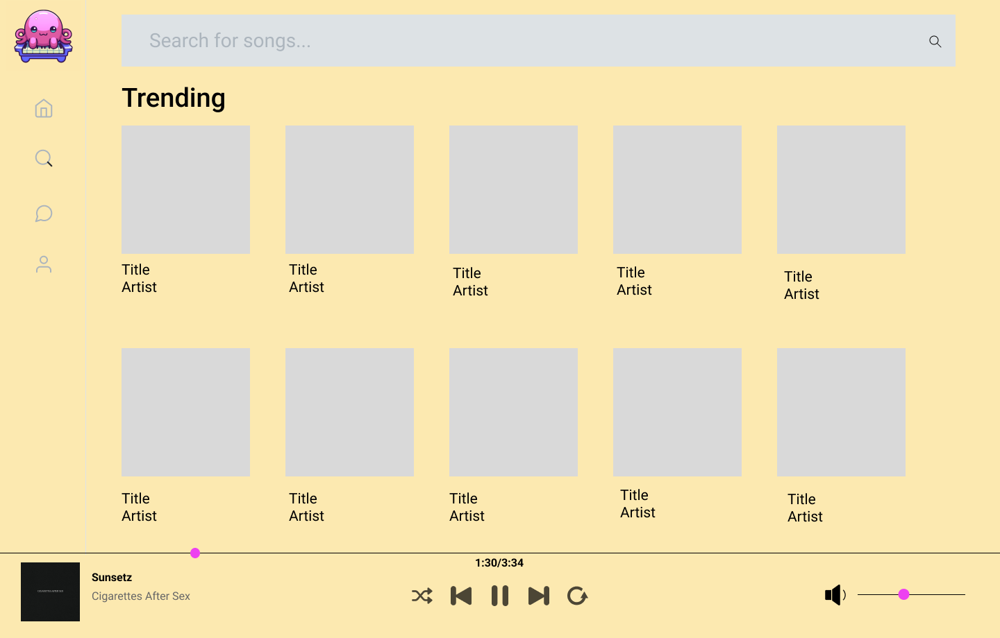
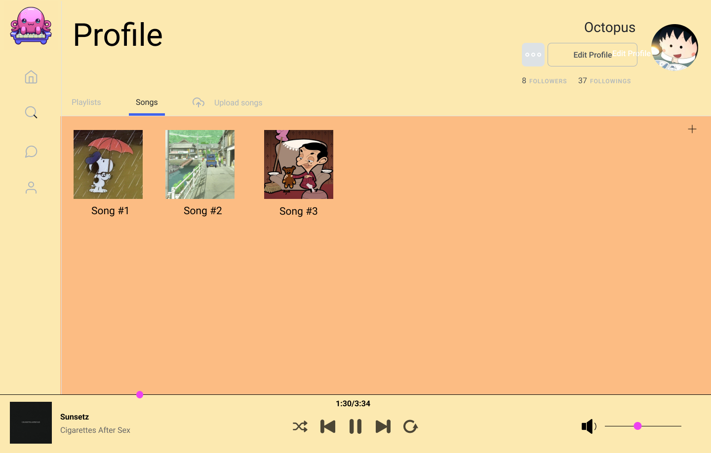
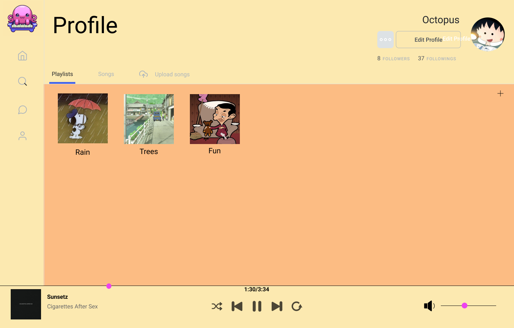
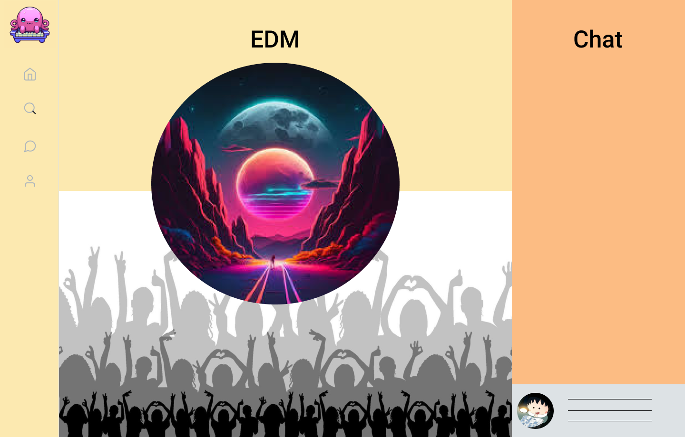
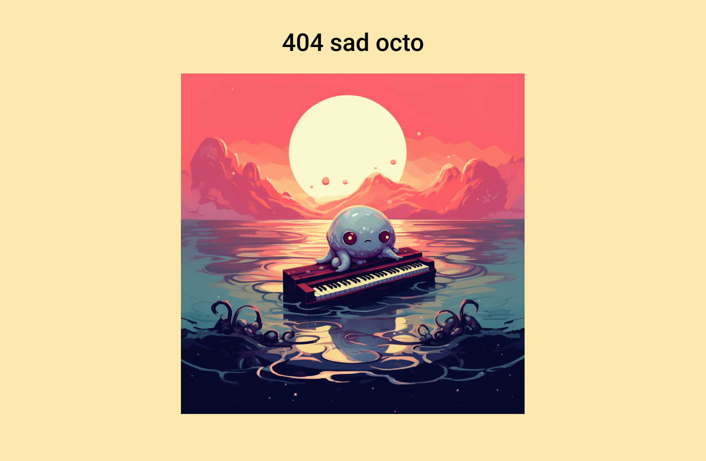

# Wireframe
## Not Logged in Home Page
This will be the first page they will see when not logged in.

## Logged in Home Page
This will be the home page logged in.

## Sign Up
This is the design of how the sign up page might look. User can sign up through this page.

## Log In
This is the design of how the login page might look. User will login through this page.

## Search/Trending
this is the search bar where users will be able to search through stages and songs.

## Songs
This is the song page design where people can see your songs.

## Add Song
this is the add song page design where users will be able to upload songs to the site.

## Playlists
this is the playlist page design where other users will be able to see your collection of songs.

## Playlists Details
this is the playlists details page design where people can see the specific songs in the playlists.

## Stage
This is the stage page design where users will be able to join and listen to music.

## Error
this is the error page

